# The Last Chapter

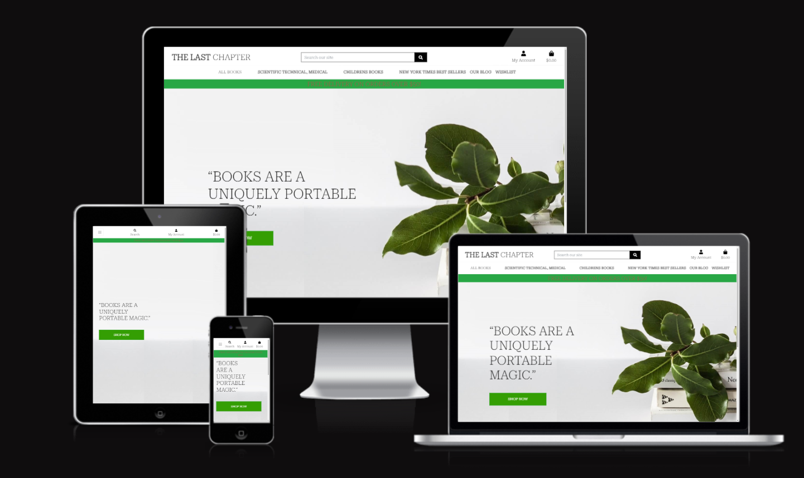

The Last Chapter is a full stack e-commerce website built using Django, Python, HTML, CSS and JavaScript. The website utilises Stripe as the payment processor.

This project was created as my 5th milestone project for my Level 5 Diploma in Web Application Development with the Code Institute.


**[LIVE DEMO - https://the-last-chapter.herokuapp.com

---

## Table of Contents
- [Table of Contents](#table-of-contents)
  - [Introduction](#introduction)
  - [UX](#ux)
    - [User Stories](#user-stories)
    - [Strategy](#strategy)
    - [Scope](#scope)
  - [Typography](#typography)
  - [Color](#color)
  - [Structure](#structure)
    - [Skeleton](#skeleton)
    - [Wireframes](#wireframes)
    - [Mobile](#mobile)
    - [Desktop](#desktop)
  - [Database Schema](#database-schema)
  - [Features](#features)
    - [Existing Features (Photo Links)](#existing-features-photo-links)
      - [Navbar](#navbar)
      - [Homepage](#homepage)
      - [Footer](#footer)
      - [Pay form Page](#pay-form-page)
      - [Register as a User](#register-as-a-user)
      - [Product Page](#product-page)
      - [404 Page](#404-page)
    - [Future Features](#future-features)
      - [Model of payment based on subscriptions](#model-of-payment-based-on-subscriptions)
      - [Chat window](#chat-window)
      - [Wishlist](#wishlist)
  - [SEO](#seo)
  - [Social Media](#social-media)
  - [Email Marketing](#email-marketing)
  - [Testing](#testing)
    - [Testing User Stories from User Experience (UX) Section](#testing-user-stories-from-user-experience-ux-section)
      - [robots.txt](#robotstxt)
      - [sitemap.xml](#sitemapxml)
      - [Functionality Testing](#functionality-testing)
  - [Deployment](#deployment)
      - [Deploy to Heroku](#deploy-to-heroku)
  - [Credits](#credits)
      - [Media](#media)
      - [Code](#code)
      - [Programming Languages](#programming-languages)
      - [Payments](#payments)
      - [Frameworks, Libraries \& Programs Used](#frameworks-libraries--programs-used)
      - [Acknowledgements](#acknowledgements)

**[LIVE DEMO - https://the-last-chapter.herokuapp.com

*

## Introduction


The Last Chapter is a Business to Consumer (B2C) e-commerce site.
The site is an book retailer best known for selling books, stationery, cards, gifts and souvenirs. 
The inspiration of the website came from my visit to Bucharest Romania and saw an old man selling old books on the sidewalk of a main street, I stoped and had a browse and I was impressed by the huge selection of old books, I tought that he could have a cool website for old vintage books.

The sites primary audience will be people who love to read hard cover books.
Print books have the feel of a book that many readers love. You can hold it, turn the pages, and feel the paper, readers of print books absorb and remember more of the plot than readers of e-books do, according to a study that was presented in Italy in 2014. In an earlier study, print readers also scored higher in other areas, such as empathy, immersion in the book, and understanding of the narrative.

According to statista.com

Data on revenue from hardback book sales in the United States between 2016 and 2021 showed that the figure increased consistently on an annual basis with the exception of 2019, and reached 3.7 billion U.S. dollars in 2021. Hardback sales make up the majority of reported trade revenues within the U.S. book publishing industry, generating more than e-books, downloaded audio, physical audio, and board books combined. 


## UX

  ### User Stories

  User roles are included in this project as there are different features of the site dependant on what type of user you are. There are three categories of user for the site, guest users (those who do not have an account), Users (who have signed up and verified their account) and Admins (users who have superuser status and are able to perform additional tasks on the site reserved for shop owners, such as adding new products.) Admins are also able to use their accounts in the same way a user would, such as purchasing items.

  User story format/steps has been taken from Boutique Ado and imported from Repository ecommerce2 (a test for my project) and more issues have been resolved manually during the project.
  
  -Account Creation</a>

- VIEWING AND NAVIGATION
  - As a shopper, I want to view items in my bag to be purchased so I can identify the total cost of my purchase and all items I will receive.</a>
  - As a shopper, I want to view orders and confirmation after checkout so I can verify that I haven't made any mistakes.</a>
  
- REGISTRATION AND USER ACCOUNTS
  - As a user, I want easily register for an account so I can have personal account information.</a>
  - As a user, I want to easily recover my password in case I forgot it so I can recover access to my account.</a>
  - Log In / Log Out  As a user,   I want to easily log in or log out so I can access my personal account details.</a>
  - As a shopper, I can change my account user details(name) so I can pay with another card without problems.</a>
  - >As a shopper, I can delete my account and details if I don't want to use the website or if my details to not kept in the database.</a>
  - As a Shopper, I can receive an email of confirmation when I am resetting my password so that I know that my new password is active and has been changed successfully.</a>
  - As a user, I want to have a personalized user profile so I can view my personal order history and order confirmations and save my payment information.</a>
  - As a shopper, I want to receive an email confirmation after checking out so I can keep the confirmation of what I've purchase for my records.</a>
    
- SORTING AND SEARCHING
  - As a shopper, I can choose the category that I want to see and the group of products I am interested <a>
  - As a shopper, I want to sort the list of available products so I can easily categorically sort products.</a>
  
- PURCHASING AND CHECKOUT
  - As a shopper, I want to adjust the number of individual items in my bag so I can easily make changes to my purchase before checking out.</a>
  - As a shopper, I can delete items from my basket so that I can buy only the items that I need.</a>
  - As a shopper I can press the delete button so that I can have the final price after I had deleted an item in my cart/basket.</a>
  
- ADMIN AND STORE MANAGEMENT
  - As a site owner, I want to add a product so I can add new items to my store.</a>
  - As a store owner, I want to edit/update a product so I can change product prices, descriptions, images, and other product criteria.</a>
  - As a shop owner, I want to delete a product so I can remove items that is no longer for sale.</a>
   
  
  ### Strategy

  - This is a website where users can find old books, office supplies and soubvenirs : 
  - Users that are passionate readers :
   ### Scope
   - The website provides for the user an easy navigation , photos,content,filter and prices with regards the books.

## Typography
 - For typography has been used <a href=https://fonts.google.com/specimen/Roboto
 target='_blank'> Google Fonts Roboto</a>

 
### Skeleton

#### **Wireframes** 
  
  * Base Template - This template contains the header and footer which are used throughout the website. This template is used as a base and then other pages content will be injected into main section using django template language.
  
  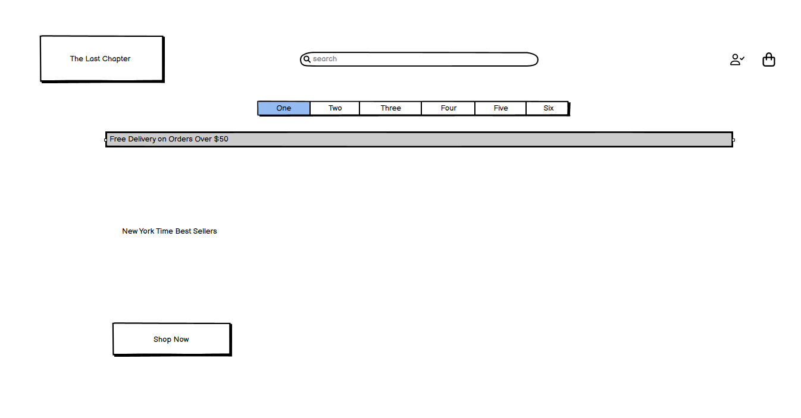

* Register Page - The register page will allow users to register for an account with The Last Chapter in one of two ways - registering for an account with a username/ 
   email or via a social account.

  The username/email path will require users to choose a username, a password which will be entered twice to confirm the user hasn't made an error when entering the password and their email address, which again will be required to be entered twice to confirm there are no mistakes in the users input.

  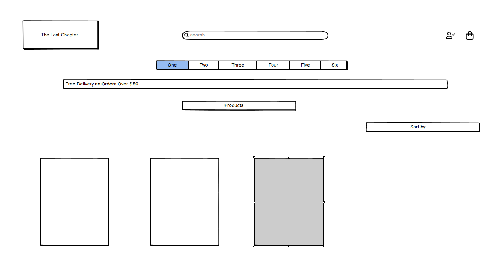

* Bag Page - When a user has items in their bag, they will be shown an image of the item, the title

* Wish list Page - The wish list page is very similar in layout to the bag page. It displays an image of the item, the title, selected size and sku for the product along with the product price. There is also has a button to remove the product from their wish list. The user can add an item from their wish list to their bag by clicking on the product which will take them to the product details page where they can select sizes and quantity.

  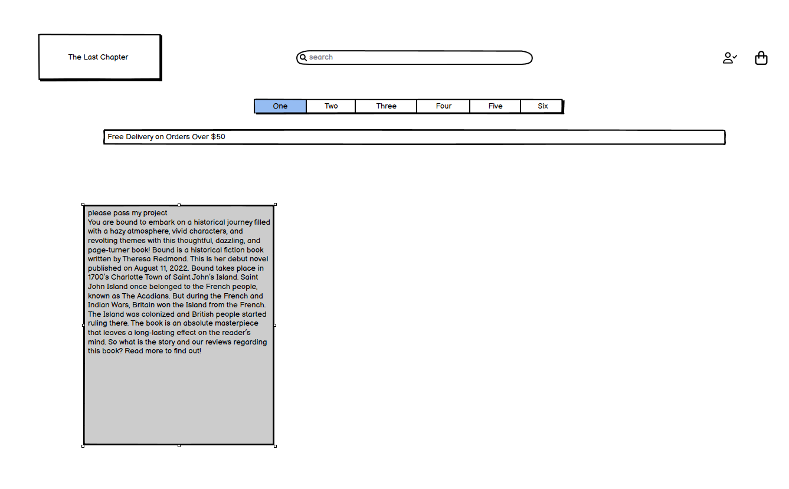

* Checkout Page - The checkout page requires the user to fill in their details, along with a delivery address. They are given the option via a checkbox to save the information they input to their profile. If the user has already filled in their information in their profile, the form will be pre-populated with this information.

  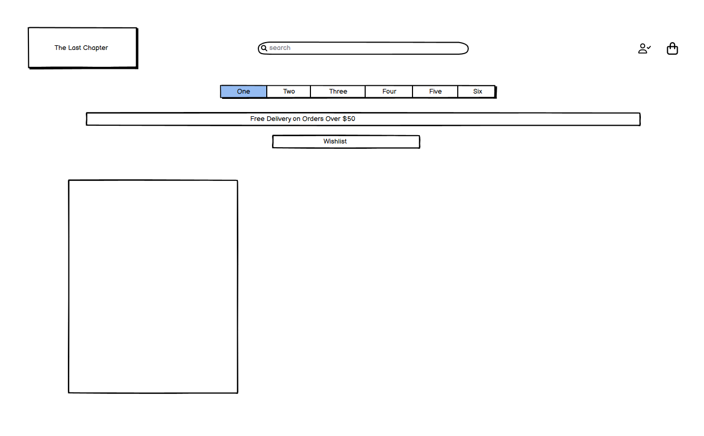

   ### Mobile


   ### Desktop


## Database Schema

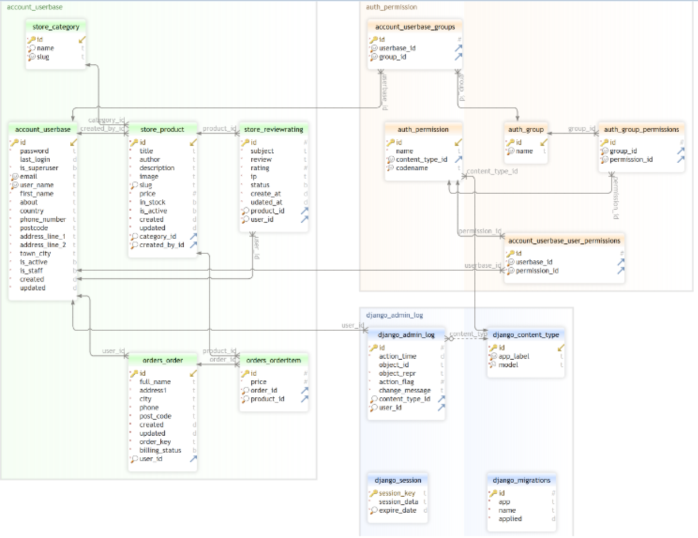
  

## Features

  
   ### Existing Features

   #### Navbar


  
   #### Homepage

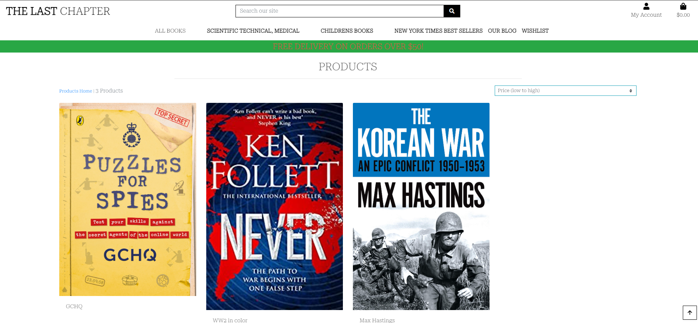

   #### Wishlist
   


   #### Checkout Page
   


   #### Register as a User

  


   #### Product Page
 


   #### 404 Page
   


   ### Future Features 

   #### Model of payment based on subscriptions

   #### Chat window

   #### SEO

   #### Social Media
    
  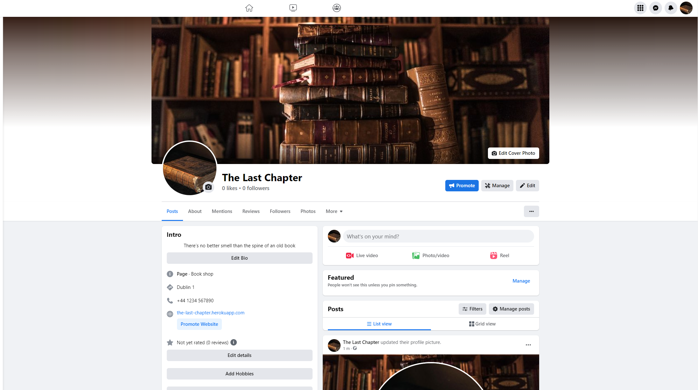

   #### Email Marketing 

 - [Mailchimp](https://mailchimp.com/) was used for this section 
  - In the website's footer, users can sign up for an email newsletter.
  - All admin emails include a convenient unsubscribe link.

   ##### robots.txt


   ##### sitemap.xml  

  ## Testing

  The project was manually tested by following the steps :
  - Code was run trough the validator resulting no issues
  - Deploying the project from gitpod workspace trough Heroku
  - The site was also tested on I-Pad , I-Phone and Laptop.
  

### Python

[Code Institute Python Linter](https://pep8ci.herokuapp.com/) was used to validate the python. I have also installed [PyCodeStyle](https://pycodestyle.pycqa.org/en/latest/intro.html#configuration) in my gitpod to enable me to check my code meets PEP8 guidelines during development.

| File | Result | Evidence |
| :--- | :--- | :---: |
| custom_storages.py | Pass | [custom_storages.py validation](readme/custom_storages.png) |
| **The Last Chapter** |
| **BAG** |
| bag/urls.py | Pass | [urls.py validation](readme/bag_urls_test.png) |
| bag/views.py | Pass | [views.py validation](readme/bagviewstest.png) |
| bag/context.py | Pass | [contexts.py validation](readme/contextbag.png) |
| **CHECKOUT** |
| checkout/admin.py | Pass | [admin.py validation](readme/checkout_admin.png) |
| checkout/forms.py | Pass | [forms.py validation](readme/checkout_forms.png) |
| checkout/models.py | Pass | [models.py validation](readme/checkout_models.png) |
| checkout/signals.py | Pass | [signals.py validation](readme/checkout_signals_test.png) |
| checkout/urls.py | Pass | [urls.py validation](readme/checkout_urls_test.png) |
| checkout/views.py | Pass | [views.py](readme/checkout_views.png) |
| checkout/webhook_handler.py | Pass | [webhook_handler.py](readme/checkout_webhook_handler_test.png) |
| checkout/webhooks.py | Pass| [webhooks.py](readme/checkout_webhook_test.png) |
| **PRODUCTS** |
| products/admin.py | Pass | [admin.py validation](readme/products_admin.png) |
| products/apps.py | Pass | [apps.py validation](readme/products_apps.png) |
| products/forms.py | Pass | [forms.py validation](readme/products_forms.png) |
| products/models.py | Pass | [models.py validation](readme/products_models.png) |
| products/urls.py | Pass | [urls.py validation](readme/products_urls.png) |
| products/views.py | Pass | [views.py validation](readme/products_views.png) |
| products/widgets.py | Pass | [widgets.py validation](readme/products_widgets.png) |
| **PROFILES** |
| profiles/apps.py | Pass | [apps.py validation](readme/profile_apps.png) |
| profiles/forms.py | Pass | [forms.py validation](readme/profile_forms.png) |
| profiles/models.py | Pass | [models.py validation](readme/profiles_models.png) |
| profiles/urls.py | Pass | [urls.py validation](readme/profile_urls.png) |
| profiles/views.py | Pass | [views.py validation](readme/profile_views.png) |
| **BLOG** |
| blog/urls.py | Pass | [urls.py validation](readme/blog_urls_test.png)
| blog/views.py | Pass | [views.py validation](readme/blog_views_test.png)
| blog/widgets.py | Pass | [widgets.py validation](readme/blog_widgets_test.png)
| blog/models.py | Pass | [models.py validation](readme/blog_models_test.png)
| blog/forms.py | Pass | [forms.py validation](readme/blog_forms_test.png)
| blog/admin.py | Pass | [admin.py validation](readme/blog_admin_test.png)

  ### Testing User Stories from User Experience (UX) Section

  - All user stories in the list above has been tested and confirmed after implementation.
   
  #### robots.txt
   -  
  #### sitemap.xml  
   -  
  
  #### Functionality Testing

  * Lighthouse

    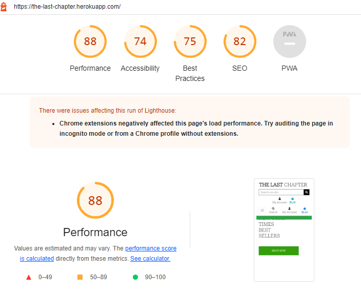

  * HTML

  * CSS
    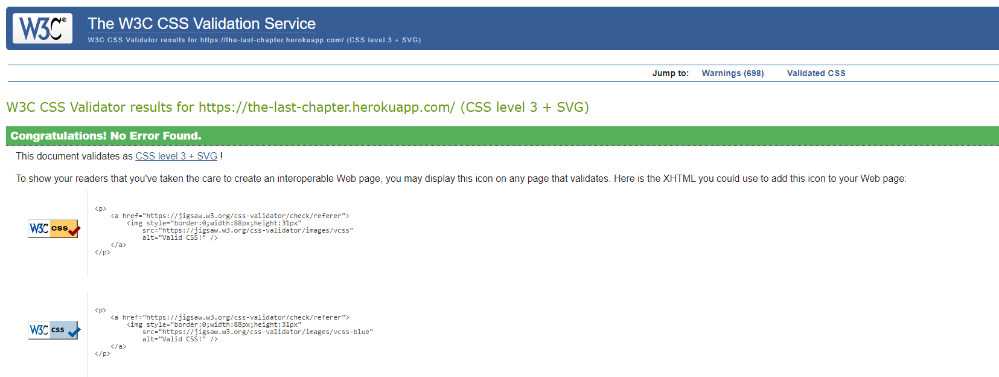


  * PEP8 
  

  ## Deployment

  Local Deployment

  Running locally
* Log in to GitHub and locate the Repository for this site.
* Under the repository name, above the list of files, click "Code".
* Here you can either Clone or Download the repository.
* You should clone the repository using HTTPS, clicking on the icon to copy the link.
* Open Git Bash.
* Change the current working directory to the new location, where you want the cloned directory to be.
* Type git clone, and then paste the URL that was copied in Step 4.
* Press Enter, and your local clone will be created.
* You will also need to install all of the project requirements. This can be done using the command pip3 install -r requirements.txt.
* Type python3 app.py in your GitPod terminal to run your local site of this project.

  #### Deploy to Heroku

    Deployment
The website of this project requires back-end technologies such as server, application, and database so the website is deployed on Heroku, which is a cloud platform with a service supporting several programming languages, because GitHub can only host a static websites.
Before deploying the website to Heroku, there are three important steps to follow to make the application work in Heroku correctly.
* Create requirements.txt file that contains the names of packages being used in Python. It is important to update the file if other packages or modules are installed during the project.
* Create Procfile that contains the name of the application file so that Heroku knows what to run.
* Push them into GitHub.
* Once above steps have been followed the website can be deployed. Please find the steps of the deployment in Heroku:
* Create an account in Heroku
* Click New & Create new app to create a new app
* Put an app name, which must be unique, choose a region and click create app
* Go to Deploy section and click Connect to GithHub
* Search for the repository by the repository name and connect it
* Before clicking Enable Automatic Deploys, hidden variables such as IP address, PORT, SECRET_KEY need to be recorded in Heroku. Go to Settings, click 'Reveal config vars' and fill out necessary keys and values.
* Once all the hidden variables are recorded, then click Enable Automatic Deploys and click Deploy Branch (Main should be selected unless you want other branches to be deployed).
* When the app is deployed by Heroku correctly, there is a confirmation message and you can access the app.

#### **Set up AWS hosting for static and media files**

! NOTE: These instructions are for setting up AWS hosting as of 5/1/23 - these may change slightly in future versions of AWS.

1. Sign up or login to your [aws amazon account](https://aws.amazon.com) on the top right by using the manage my account button and then navigate to S3 to create a new bucket.
2. The bucket will be used to store our files, so it is a good idea to name this bucket the same as your project. Select the region closest to you. In the object ownership section we need to select ACLs enabled and then select bucket owner preferred. In the block public access section uncheck the block public access box. You will then need to tick the acknowledge button to make the bucket public. Click create bucket.
3. Click the bucket you've just created and then select the properties tab at the top of the page. Find the static web hosting section and choose enable static web hosting, host a static website and enter index.html and error.html for the index and error documents (these won't actually be used.)
4. Open the permissions tab and copy the ARN (amazon resource name). Navigate to the bucket policy section click edit and select policy generator. The policy type will be S3 bucket policy, we want to allow all principles by adding `*` to the input and the actions will be get object. Paste the ARN we copied from the last page into the ARN input and then click add statement. Click generate policy and copy the policy that displays in a new pop up. Paste this policy into the bucket policy editor and make the following changes: Add a `/*` at the end of the resource value. Click save.


#### **Creating AWS groups, policies and users**

1. Click the services icon on the top right of the page and navigate to IAM - manage access to AWS services. On the left hand navigation menu click user groups and then click the create group button in the top right. This will create the group that our user will be placed in.
2. Choose a name for your group and click the create policy button on the right. This will open a new page.
3. Click on the JSON tab and then click the link for import managed policy on the top right of the page.
4. Search for S3 and select the one called AmazonS3FullAccess, then click import.
5. We need to make a change to the resources, we need to make resources an array and then change the value for resources. Instead of a `*` which allows all access, we want to paste in our ARN. followed by a comma, and then paste the ARN in again on the next line with `/*` at the end. This allows all actions on our bucket, and all the resources in it.
6. Click the next: tags button and then the next:review .
7. Give the policy a name and description. Click the create policy button.
8. Now we need to atach the policy we just created. On the left hand navigation menu click user groups, select the group and go to the permissions tab. Click the add permissions button on the right and choose attach policies from the dropdown.
9. Select the policy you just created and then click add permissions at the bottom.
10. Now we'll create a user for the group by clicking on the user link in the left hand navigation menu, clicking the add users button on the top right and giving our user a username . Select programmatic access and then click the next: permissions button.
11. Add the user to the group you just created and then click next:tags button, next:review button and then create user button.
12. You will now need to download the CSV file as this contains the user access key and secret access key that we need to insert into the Heroku config vars. Make sure you download the CSV now as you won't be able to access it again.

#### **Setting up Stripe**

1. We now need to add our Stripe keys to our config vars in Heroku to keep these out of our code and keep them private. Log into Stripe, click developers and then API keys.
2. Create 2 new variables in Heroku's config vars - for the publishable key (STRIPE_PUBLIC_KEY) and the secret key (STRIPE_SECRET_KEY) and paste the values in from the Stripe page.
3. Now we need to add the WebHook endpoint for the deployed site. Navigate to the WebHooks link in the left hand menu and click add endpoint button.
4. Add the URL for our deployed sites WebHook, give it a description and then click the add events button and select all events. Click Create endpoint.
5. Now we can add the WebHook signing secret to our Heroku config variables as STRIPE_WH_SECRET.
6. In settings.py:

    ```python
    STRIPE_PUBLIC_KEY = os.getenv('STRIPE_PUBLIC_KEY', '')
    STRIPE_SECRET_KEY = os.getenv('STRIPE_SECRET_KEY', '')
    STRIPE_WH_SECRET = os.getenv('STRIPE_WH_SECRET', '')
    ```

## Credits


Code Institute Boutique Ado walkhtrough


  #### Media

   - All images for the book  have been taken from  http://www.amazon.com
   - Cover image for the site has been taken from  https://www.centracare.com
   - All description content for the books has been taken from https://books.google.ie/books/about/

  #### Code 

   - Through this project, I relied heavily on tutorials and Bootstrap examples.

   - Code Institute Boutique Ado and Very Academy on Youtube

   - I found this bookstore walkthrough to be brilliant. I found it extremely helpful for making Django sites more dynamic. As a result of this tutorial, I learned how to make AJAX calls. I also learned a lot about database design and setting up a Stripe webhook.

   - [Codegrepper](https://www.codegrepper.com/code-examples/python/jinja+get+current+url+django) as a general resource.

   - [W3School](https://www.w3schools.com/) as a general resource.

  #### Programming Languages 

  - Python
  - HTML
  - CSS
  - JavaScript
  

  #### Payments

  - Payment functionality was implemented using the Stripe system. The system was set up using the Boutique Ado project and Stripe documentation.

  - For testing the payment system, the following dummy details can be used: Card number: 4242 4242 4242 4242 Expiry: 04/24 CVC: 242

  - No auth: 4242424242424242

  - Auth: 4000002500003155

  - Error: 4000000000009995

  
  #### Frameworks, Libraries & Programs Used

  - [Balsamiq](https://balsamiq.cloud/) - Was used to create the wireframes
  - [Bootstrap](https://getbootstrap.com/) - Was used to contribute to responsiveness and styling of the site
  - [TinyJPG](https://tinyjpg.com/) - Was used to compress images before uploading
  - [GitHub](https://github.com/) - Holds the repository of my project, GitHub connects to GitPod and Heroku
  - [GitPod](https://gitpod.io/) - Connected to GitHub, GitPod hosted the coding space,
   allowing the project to be built and then committed to the GitHub repository.
  - [Heroku](https://heroku.com/) - Connected to the GitHub repository, Heroku is a cloud application platform used 
   to deploy this project so the backend language can be utilised/tested.
  - [Django](https://www.djangoproject.com/) - This framework was used to build the foundations of this project
  - [Gunicorn](https://gunicorn.org/) - Gunicorn is a pure-Python HTTP server for WSGI applications.
  - [Cloudinary](https://cloudinary.com/) - Used to store images online for the recipe posts.
   a list of ingredients and method steps.
  - [GoogleFonts](https://fonts.google.com/) - Provide fonts for the website.
  - [FontAwesome](https://fontawesome.com/) - Was used for icons.
  - [AmIResponsive](https://ui.dev/amiresponsive) - To check if the site is responsive on different screen sizes.
  - [W3CMarkupValidator](https://jigsaw.w3.org/) - Was used to validate HTML.
  - [Colors](https://color-hex.org/) - To make color palette

## Errors

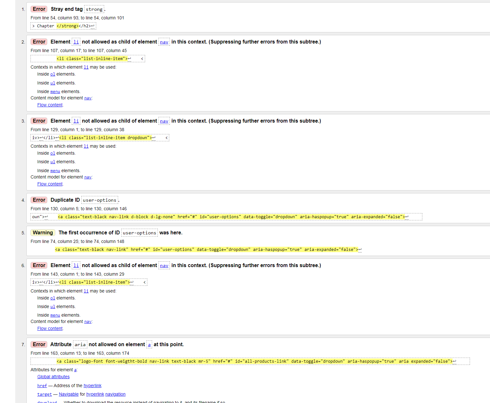

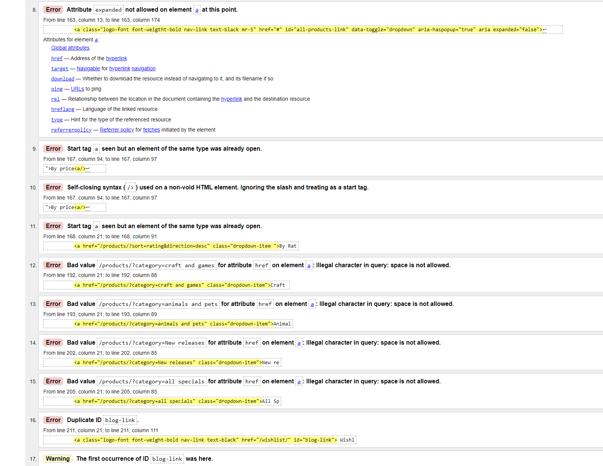

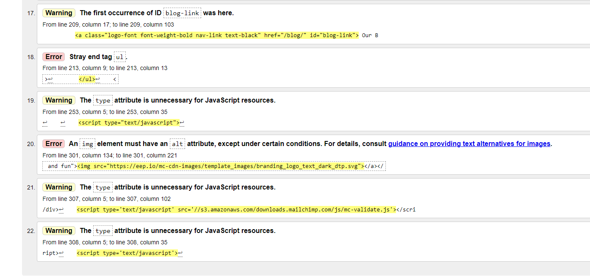

 
  #### Acknowledgements

Code Institute 